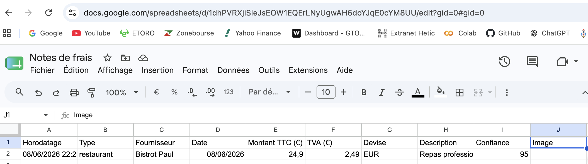

# Note de cours

## Champs attendus (`backend.py`)

```python
self.expected_fields = {
    "type_document": None,  # gere erreur si le json ne retourne rien
    "fournisseur": None,
    "date": None,
    "montant_ttc": None,
    "tva": None,
    "devise": "EUR",
    "description": None,
    "confiance": None,
}
```

## Test `backend.py`

Commande :

```bash
python3 backend.py
```

Résultat :

```json
{
  "type_document": "restaurant",
  "fournisseur": "Green Field",
  "date": "26/05/2016",
  "montant_ttc": 56.58,
  "tva": 4.68,
  "devise": "USD",
  "description": "Repas professionnel",
  "confiance": 95
}
```

## Test `sheets.py`

Commande :

```bash
python sheets.py
```

Résultat terminal :

```
Ligne ajoutée dans Google Sheets :
['08/06/2026 22:29:25', 'restaurant', 'Bistrot Paul', '08/06/2026', 24.9, 2.49, 'EUR', 'Repas professionnel', 95, None]
```

Résultat dans Google Sheets :


